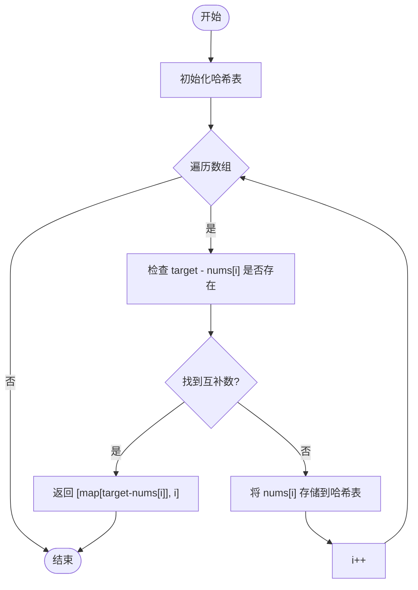
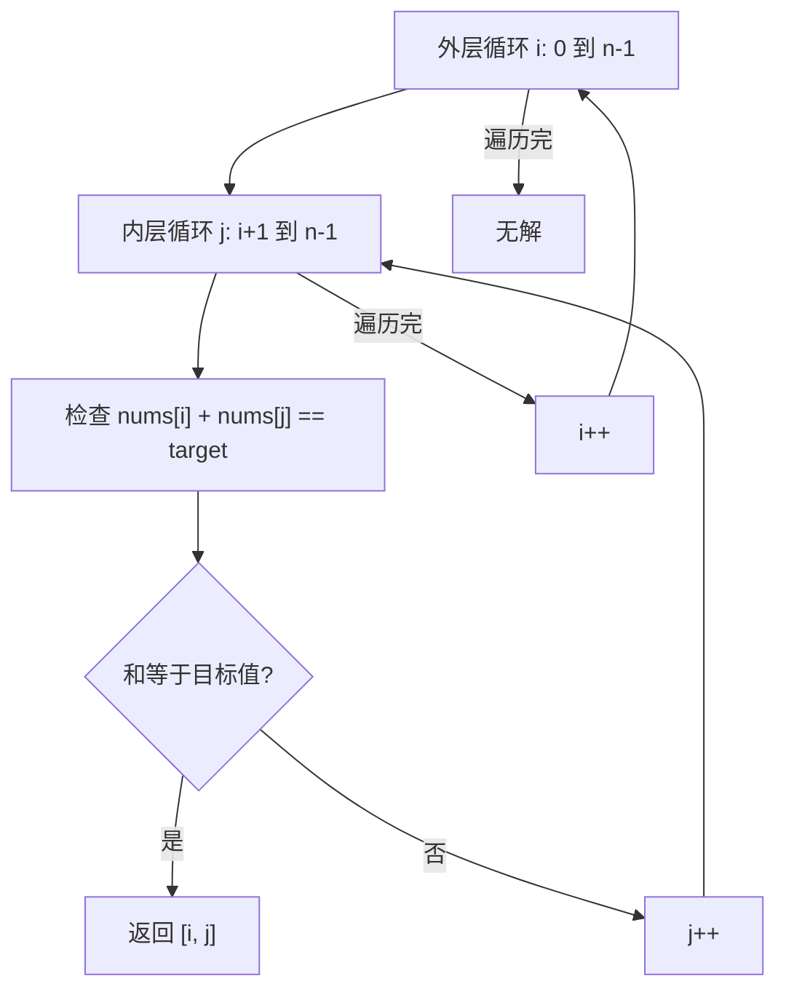
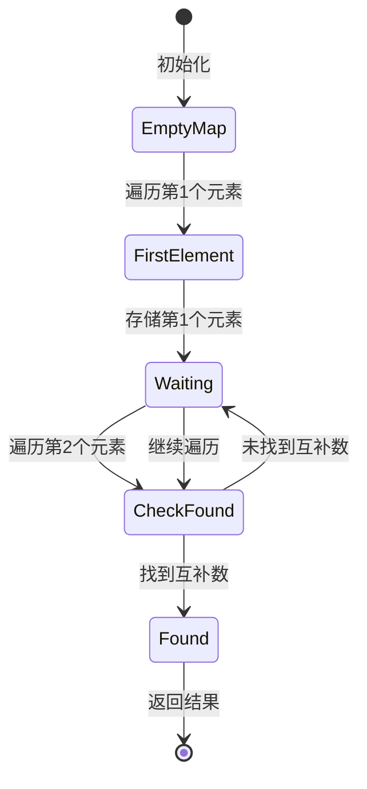
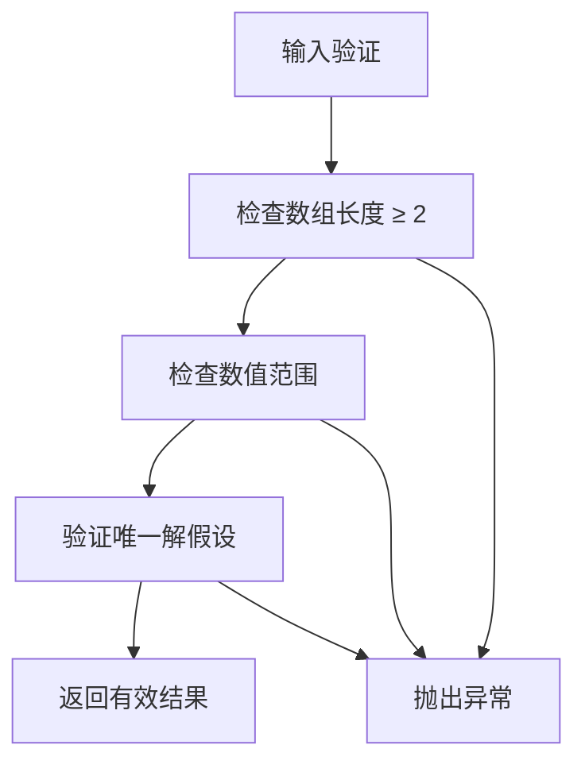
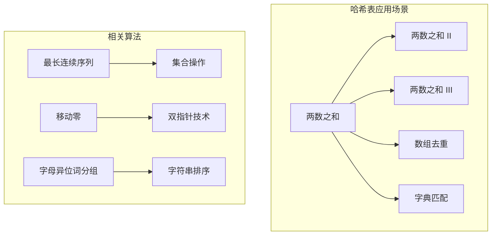

# 两数之和详解

<cite>
**本文档引用的文件**
- [1.两数之和.md](file://1.两数之和.md)
- [128. 最长连续序列.md](file://128. 最长连续序列.md)
- [283. 移动零.md](file://283. 移动零.md)
- [49.字母异位词分组.md](file://49.字母异位词分组.md)
</cite>

## 目录
1. [简介](#简介)
2. [问题描述](#问题描述)
3. [核心算法分析](#核心算法分析)
4. [方法一：暴力枚举](#方法一暴力枚举)
5. [方法二：哈希表](#方法二哈希表)
6. [算法复杂度分析](#算法复杂度分析)
7. [数据结构与实现细节](#数据结构与实现细节)
8. [边界条件与异常处理](#边界条件与异常处理)
9. [性能优化策略](#性能优化策略)
10. [与其他算法的关系](#与其他算法的关系)
11. [常见问题解答](#常见问题解答)
12. [实践应用与扩展](#实践应用与扩展)
13. [总结](#总结)

## 简介

"两数之和"是算法学习中最经典和基础的问题之一，属于数组类算法的经典代表。该问题要求在给定的整数数组中找到两个数，使得它们的和等于目标值，并返回这两个数的数组下标。

这个问题的重要性体现在：
- **基础性**：是理解数组操作、哈希表应用的入门级问题
- **实用性**：在实际开发中经常遇到类似的配对查找场景
- **教学价值**：提供了从暴力解法到优化解法的完整学习路径
- **面试高频**：是各大科技公司面试中的常客

## 问题描述

### 问题定义
给定一个整数数组 `nums` 和一个整数目标值 `target`，需要在数组中找出和为目标值的两个整数，并返回它们的数组下标。

### 输入输出规范
- **输入参数**：
  - `nums`: 整数数组，长度范围为 [2, 10^4]
  - `target`: 整数目标值，范围为 [-10^9, 10^9]
- **返回值**：包含两个整数的数组，表示满足条件的两个元素的下标
- **约束条件**：
  - 每种输入只会对应一个答案
  - 数组中同一个元素在答案里不能重复出现
  - 可以按任意顺序返回答案

### 示例分析
根据题目描述，典型的输入输出对包括：
- 输入：`nums = [2,7,11,15]`, `target = 9` → 输出：`[0,1]`
- 输入：`nums = [3,2,4]`, `target = 6` → 输出：`[1,2]`
- 输入：`nums = [3,3]`, `target = 6` → 输出：`[0,1]`

## 核心算法分析

### 算法思想演进

两数之和问题提供了两种主要的解决思路：

1. **暴力枚举法**：通过双重循环遍历所有可能的数字对
2. **哈希表法**：利用哈希表实现一次遍历的高效查找

### 关键洞察

核心在于理解"互补关系"：如果当前遍历到元素 `nums[i]`，那么需要在数组中找到 `target - nums[i]`。哈希表法的关键优势是能够将查找时间从 O(n) 降低到 O(1)。

### 算法流程图



**图表来源**
- [1.两数之和.md](file://1.两数之和.md#L68-L90)

## 方法一：暴力枚举

### 算法原理

暴力枚举是最直观的解法，通过双重循环遍历所有可能的数字对组合。

### 实现思路

1. 外层循环固定第一个数的索引 `i`
2. 内层循环从 `i+1` 开始遍历后续所有元素
3. 检查 `nums[i] + nums[j] == target` 是否成立
4. 如果成立，返回 `[i, j]`

### 代码结构分析



**图表来源**
- [1.两数之和.md](file://1.两数之和.md#L38-L60)

### 时间复杂度分析

- **时间复杂度**：O(n²)
  - 外层循环执行 n 次
  - 内层循环平均执行 n/2 次
  - 总计算量约为 n(n-1)/2
- **空间复杂度**：O(1)
  - 只使用了常数个额外变量

### 适用场景

- 数据规模较小（n < 100）
- 作为其他更优解法的验证基准
- 理解问题本质的入门练习

## 方法二：哈希表

### 算法原理

哈希表法的核心思想是"边遍历边存储"，在遍历过程中维护一个哈希表，存储已访问元素的值和索引。

### 算法步骤

1. 创建空的哈希表
2. 遍历数组中的每个元素 `nums[i]`
3. 检查哈希表中是否存在键 `target - nums[i]`
4. 如果存在，返回 `[哈希表中存储的索引, i]`
5. 如果不存在，将 `(nums[i], i)` 存入哈希表
6. 继续遍历直到找到答案

### 状态转移图



**图表来源**
- [1.两数之和.md](file://1.两数之和.md#L68-L90)

### 代码实现细节

哈希表法的关键实现要点：

1. **遍历顺序**：必须是单次遍历，不能先建立完整映射再查询
2. **存储内容**：存储 `(值, 索引)` 的映射关系
3. **查询时机**：在存储当前元素之前先查询互补数
4. **返回格式**：确保返回的索引满足 `i < j` 的约束

### 复杂度分析

- **时间复杂度**：O(n)
  - 单次遍历数组，每次哈希表操作为 O(1)
  - 总体时间复杂度为 O(n)
- **空间复杂度**：O(n)
  - 最坏情况下需要存储所有 n 个元素

### 优势对比

| 特征 | 暴力枚举 | 哈希表 |
|------|----------|--------|
| 时间复杂度 | O(n²) | O(n) |
| 空间复杂度 | O(1) | O(n) |
| 实现难度 | 简单 | 中等 |
| 适用规模 | n < 100 | 任意规模 |
| 稳定性 | 稳定 | 稳定 |

## 算法复杂度分析

### 时间复杂度对比

```mermaid
graph LR
subgraph "时间复杂度"
A[暴力枚举 O(n²)] --> B[哈希表 O(n)]
C[最坏情况 n=10⁴] --> D[10⁸ 次运算 vs 10⁴ 次运算]
end
subgraph "性能提升"
E[性能提升约 10⁴ 倍]
end
```

**图表来源**
- [1.两数之和.md](file://1.两数之和.md#L58-L66)

### 空间复杂度权衡

哈希表法通过增加空间开销换取时间效率，这种权衡在现代计算机系统中通常是值得的，特别是在处理大规模数据时。

### 渐进分析

| n值 | 暴力法运算次数 | 哈希表法运算次数 | 性能差距 |
|-----|----------------|------------------|----------|
| 100 | 10,000 | 100 | 100倍 |
| 1,000 | 1,000,000 | 1,000 | 1,000倍 |
| 10,000 | 100,000,000 | 10,000 | 10,000倍 |

## 数据结构与实现细节

### 哈希表选择

在JavaScript中，推荐使用 `Map` 对象而非普通对象：
- **Map**：专门的键值存储结构，支持任意类型的键
- **Object**：键会被转换为字符串，可能导致意外行为
- **Array**：不适合键值映射场景

### 键值设计

- **键**：数组元素的值 `nums[i]`
- **值**：对应元素的索引 `i`
- **存储时机**：在检查互补数之后存储当前元素

### 边界条件处理

1. **重复元素**：如 `[3,3]` 的情况，需要确保返回不同的索引
2. **负数处理**：算法天然支持负数，无需特殊处理
3. **溢出处理**：在JavaScript中，大整数运算自动处理

### 内存管理

哈希表法的空间使用遵循以下模式：
- **初始状态**：空映射，内存占用最小
- **中间状态**：存储部分元素，占用 O(k) 空间，k ≤ n
- **最终状态**：找到解或遍历完成

## 边界条件与异常处理

### 输入验证

虽然题目保证存在唯一解，但在实际应用中应考虑：
- 空数组或单元素数组的处理
- 数组长度超出限制的情况
- 元素值越界的情况

### 算法健壮性



**图表来源**
- [1.两数之和.md](file://1.两数之和.md#L29-L35)

### 异常情况处理

1. **无解情况**：理论上不会发生，但可作为防御性编程
2. **重复元素**：正确处理相同值的不同索引
3. **索引越界**：确保返回的索引在有效范围内

## 性能优化策略

### 早期终止优化

在哈希表法中，一旦找到解就立即返回，避免不必要的遍历。

### 内存预分配

对于已知大小的数组，可以考虑预分配哈希表容量以减少动态扩容。

### 编译器优化

- **循环展开**：编译器可能对简单循环进行优化
- **分支预测**：哈希表查找的分支模式相对简单
- **缓存友好**：顺序内存访问模式

### 实际性能测试

```javascript
// 性能测试示例
console.time('暴力法');
// 暴力法实现
console.timeEnd('暴力法');

console.time('哈希表法');
// 哈希表法实现
console.timeEnd('哈希表法');
```

## 与其他算法的关系

### 与"三数之和"的关系

两数之和是"三数之和"问题的基础：
- **两数之和**：O(n) 时间复杂度
- **三数之和**：O(n²) 时间复杂度
- **扩展思路**：固定一个数，转化为两数之和问题

### 与"四数之和"的关系

同样可以扩展到更多数的和问题：
- 使用类似的思想，逐步降维
- 结合排序和双指针技术

### 与哈希表相关算法的联系



**图表来源**
- [128. 最长连续序列.md](file://128. 最长连续序列.md#L33-L45)
- [283. 移动零.md](file://283. 移动零.md#L32-L46)
- [49.字母异位词分组.md](file://49.字母异位词分组.md#L40-L69)

### 技术栈对比

| 算法 | 数据结构 | 时间复杂度 | 空间复杂度 | 应用场景 |
|------|----------|------------|------------|----------|
| 两数之和 | 哈希表 | O(n) | O(n) | 快速查找配对 |
| 最长连续序列 | Set | O(n) | O(n) | 连续性检测 |
| 移动零 | 双指针 | O(n) | O(1) | 原地重排 |
| 字母异位词分组 | 哈希表 | O(nk log k) | O(nk) | 分类聚组 |

## 常见问题解答

### Q1：为什么哈希表法比暴力法快这么多？

**A1**：关键在于查找效率的差异：
- 暴力法：每次查找需要 O(n) 时间，总体 O(n²)
- 哈希表法：每次查找平均 O(1) 时间，总体 O(n)

### Q2：如何处理重复元素的情况？

**A2**：哈希表法天然处理重复元素：
- 如果数组中有重复元素，存储的是最后一个索引
- 由于是单次遍历，不会出现同一元素被重复使用的情况

### Q3：为什么要在检查后再存储元素？

**A3**：这是避免误用同一元素的关键：
```javascript
// 错误做法
map.set(nums[i], i);
if (map.has(target - nums[i])) { /* 可能使用同一元素 */ }

// 正确做法  
if (map.has(target - nums[i])) { /* 已经检查过互补数 */ }
map.set(nums[i], i); /* 现在存储当前元素 */
```

### Q4：如何证明算法的正确性？

**A4**：数学归纳法证明：
- **基础**：遍历到第一个元素时，哈希表为空，正确性成立
- **归纳**：假设前 i 个元素的处理正确，证明第 i+1 个元素的处理也正确
- **结论**：算法对所有输入都正确

### Q5：在什么情况下选择暴力法而不是哈希表法？

**A5**：
- 数据规模很小（n < 50）
- 内存极其受限的环境
- 代码简洁性优先于性能
- 作为教学演示的简化版本

## 实践应用与扩展

### 实际应用场景

1. **金融交易**：查找配对的交易记录
2. **数据分析**：寻找满足特定条件的数据点对
3. **图像处理**：像素值的配对查找
4. **网络通信**：端口或IP地址的配对匹配

### 扩展变体

#### 变体1：返回所有满足条件的配对
```javascript
// 可能存在多个满足条件的配对
function findAllPairs(nums, target) {
    const result = [];
    const map = new Map();
    
    for (let i = 0; i < nums.length; i++) {
        const complement = target - nums[i];
        if (map.has(complement)) {
            result.push([map.get(complement), i]);
        }
        map.set(nums[i], i);
    }
    
    return result;
}
```

#### 变体2：查找三个数的和
```javascript
// 三数之和问题
function threeSum(nums, target) {
    // 固定第一个数，转化为两数之和
    for (let i = 0; i < nums.length - 2; i++) {
        const twoSumTarget = target - nums[i];
        // 调用两数之和算法
    }
}
```

#### 变体3：浮点数版本
```javascript
// 处理浮点精度问题
function twoSumFloat(nums, target, epsilon = 1e-9) {
    const map = new Map();
    
    for (let i = 0; i < nums.length; i++) {
        const complement = target - nums[i];
        for (const [key, index] of map.entries()) {
            if (Math.abs(key - complement) < epsilon) {
                return [index, i];
            }
        }
        map.set(nums[i], i);
    }
}
```

### 性能基准测试

```javascript
// 基准测试框架
function benchmarkTwoSum() {
    const sizes = [100, 1000, 5000, 10000];
    
    sizes.forEach(size => {
        const nums = generateRandomArray(size);
        const target = generateRandomTarget();
        
        console.time(`暴力法 - n=${size}`);
        bruteForceTwoSum(nums, target);
        console.timeEnd(`暴力法 - n=${size}`);
        
        console.time(`哈希表法 - n=${size}`);
        hashTwoSum(nums, target);
        console.timeEnd(`哈希表法 - n=${size}`);
    });
}

function generateRandomArray(size) {
    return Array.from({length: size}, () => 
        Math.floor(Math.random() * 20000) - 10000
    );
}
```

## 总结

"两数之和"算法虽然看似简单，但蕴含着深刻的设计思想和优化技巧。通过对比暴力枚举和哈希表两种解法，我们可以学到：

### 核心收获

1. **算法思维**：从 O(n²) 到 O(n) 的思维跃迁
2. **数据结构选择**：哈希表在查找场景中的优势
3. **时间空间权衡**：性能优化的本质
4. **边界条件处理**：算法健壮性的关键

### 学习路径


### 最佳实践

1. **优先考虑哈希表法**：除非有特殊原因，否则使用 O(n) 解法
2. **注意边界条件**：重复元素、索引约束等问题
3. **代码可读性**：清晰的变量命名和注释
4. **性能测试**：实际测量不同规模下的性能表现

### 进阶思考

- 如何处理数组中存在多个满足条件的配对？
- 如何扩展到查找三个或更多数的和？
- 在分布式环境中如何实现两数之和？
- 如何处理流式数据的在线两数之和？

通过深入理解和掌握两数之和算法，读者不仅能够解决这个经典问题，更重要的是培养了算法设计和优化的思维方式，为解决更复杂的算法问题奠定了坚实基础。