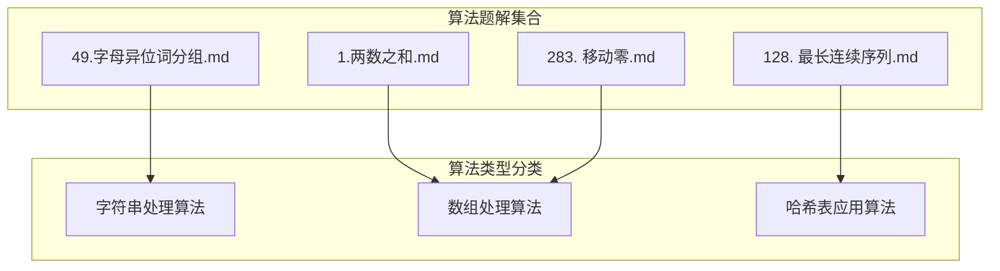
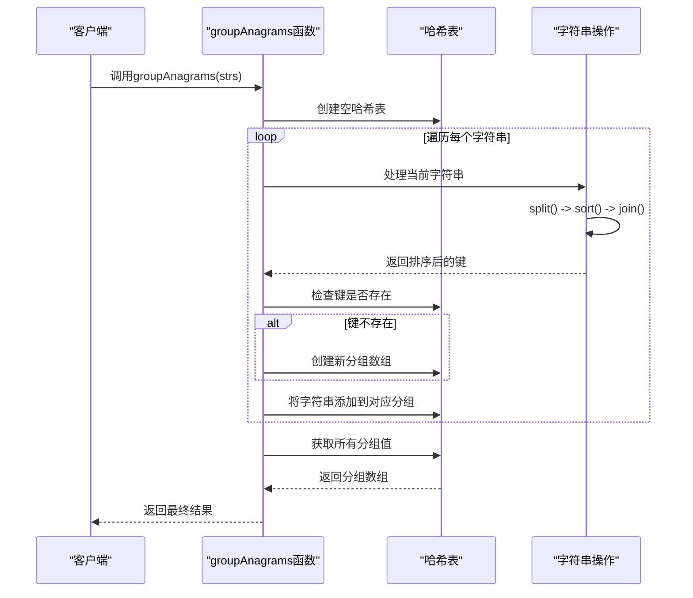
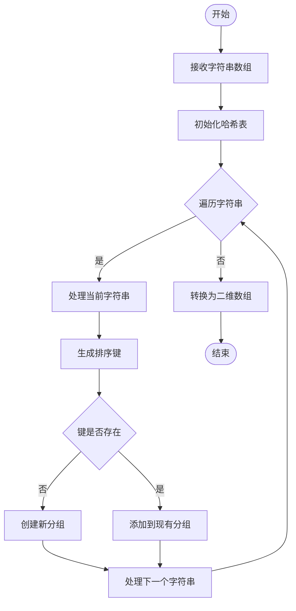
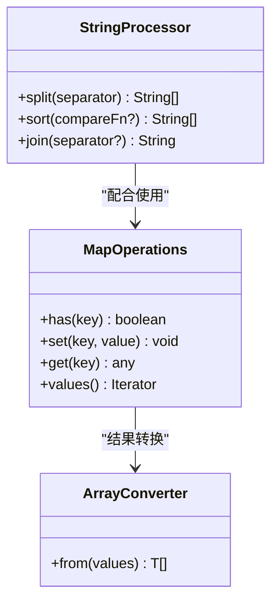
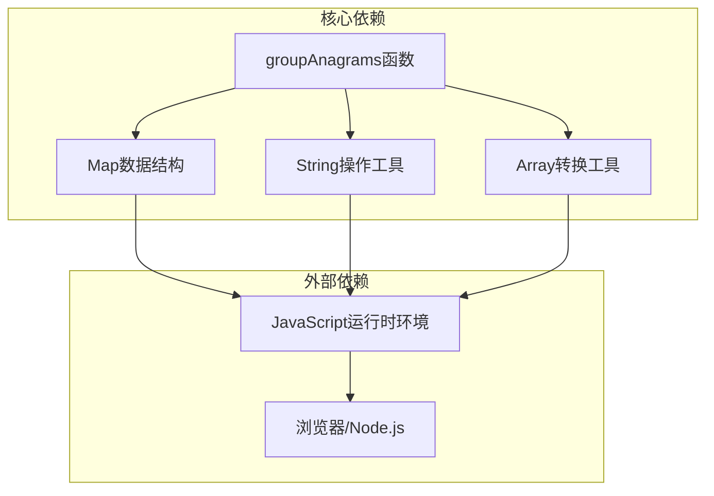

# 字母异位词分组详解

<cite>
**本文档引用的文件**
- [49.字母异位词分组.md](file://49.字母异位词分组.md)
- [1.两数之和.md](file://1.两数之和.md)
- [128. 最长连续序列.md](file://128. 最长连续序列.md)
- [283. 移动零.md](file://283. 移动零.md)
</cite>

## 目录
1. [简介](#简介)
2. [项目结构](#项目结构)
3. [核心组件](#核心组件)
4. [架构概览](#架构概览)
5. [详细组件分析](#详细组件分析)
6. [依赖分析](#依赖分析)
7. [性能考虑](#性能考虑)
8. [故障排除指南](#故障排除指南)
9. [结论](#结论)
10. [附录](#附录)

## 简介

字母异位词分组是一个经典的字符串处理算法问题。该问题要求将给定字符串数组中的字母异位词组合在一起，形成多个分组。字母异位词是指由重新排列源单词字母组成的新单词，所有源单词中的字母恰好使用一次。

本算法采用哈希表映射策略，通过将每个字符串的字符排序作为键，实现高效的分组操作。该方法的时间复杂度为O(nk log k)，其中n是字符串数组的长度，k是字符串的最大长度。

## 项目结构

该项目采用Markdown文档形式组织算法题解，每个算法题目独立成文，便于学习和查阅。



**图表来源**
- [49.字母异位词分组.md](file://49.字母异位词分组.md#L1-L81)
- [1.两数之和.md](file://1.两数之和.md#L1-L100)
- [128. 最长连续序列.md](file://128. 最长连续序列.md#L1-L96)
- [283. 移动零.md](file://283. 移动零.md#L1-L112)

**章节来源**
- [49.字母异位词分组.md](file://49.字母异位词分组.md#L1-L81)

## 核心组件

### 主要算法函数

算法的核心实现是一个名为`groupAnagrams`的函数，其主要职责包括：

- **输入验证**：接收字符串数组作为输入参数
- **键生成**：对每个字符串进行字符排序生成唯一标识键
- **分组管理**：使用哈希表维护异位词分组
- **结果输出**：将分组结果转换为二维数组格式

### 数据结构设计

```mermaid
classDiagram
class AnagramGroup {
+Map~String, String[]~ map
+String[] strs
+groupAnagrams() String[][]
-generateKey(String) String
-addWordToGroup(String, String) void
}
class HashMap {
+has(key) boolean
+set(key, value) void
+get(key) any
+values() Iterator
}
class StringProcessor {
+split(String) String[]
+sort(String[]) String[]
+join(String[]) String
}
AnagramGroup --> HashMap : "使用"
AnagramGroup --> StringProcessor : "依赖"
HashMap --> String : "键类型"
HashMap --> String[] : "值类型"
```

**图表来源**
- [49.字母异位词分组.md](file://49.字母异位词分组.md#L48-L66)

### 关键算法步骤

1. **初始化阶段**：创建空的哈希表用于存储分组
2. **遍历处理**：逐个处理输入数组中的每个字符串
3. **键生成**：将字符串转换为字符数组，排序后重新连接
4. **分组逻辑**：检查键是否存在，不存在则创建新分组
5. **结果收集**：将所有分组值转换为最终输出格式

**章节来源**
- [49.字母异位词分组.md](file://49.字母异位词分组.md#L48-L66)

## 架构概览

### 算法执行流程



**图表来源**
- [49.字母异位词分组.md](file://49.字母异位词分组.md#L48-L66)

### 数据流分析



**图表来源**
- [49.字母异位词分组.md](file://49.字母异位词分组.md#L48-L66)

## 详细组件分析

### 主要算法实现

#### 函数签名与参数

```mermaid
flowchart LR
subgraph "函数定义"
A[groupAnagrams]
B[strs: string[]]
C:return: string[][]
end
subgraph "参数约束"
D[1 <= strs.length <= 10^4]
E[0 <= strs[i].length <= 100]
F[strs[i] 仅包含小写字母]
end
A --> B
A --> C
B --> D
B --> E
B --> F
```

**图表来源**
- [49.字母异位词分组.md](file://49.字母异位词分组.md#L44-L47)
- [49.字母异位词分组.md](file://49.字母异位词分组.md#L32-L36)

#### 核心处理逻辑

算法的核心处理逻辑包含以下关键步骤：

1. **字符串预处理**：将每个字符串分解为字符数组
2. **字符排序**：对字符数组进行排序操作
3. **键生成**：将排序后的字符数组重新连接为字符串
4. **分组管理**：使用哈希表维护分组关系

#### 边界条件处理

算法能够正确处理以下边界情况：

- **空数组输入**：返回空数组
- **单字符字符串**：每个字符串自成一组
- **空字符串**：空字符串单独成组
- **重复字符串**：相同字符串归为同一组

**章节来源**
- [49.字母异位词分组.md](file://49.字母异位词分组.md#L11-L30)

### 字符串操作工具链

#### 工具函数详解



**图表来源**
- [49.字母异位词分组.md](file://49.字母异位词分组.md#L73-L80)

#### 操作序列说明

算法中使用的字符串操作序列具有以下特点：

1. **split('')**：将字符串转换为字符数组
2. **sort()**：对字符数组进行排序（默认按Unicode码点排序）
3. **join('')**：将排序后的字符数组重新连接为字符串

这些操作确保了字母异位词具有相同的排序键，从而实现正确的分组效果。

**章节来源**
- [49.字母异位词分组.md](file://49.字母异位词分组.md#L73-L79)

### 复杂度分析

#### 时间复杂度

算法的时间复杂度为O(nk log k)，其中：
- **n**：字符串数组的长度
- **k**：字符串的最大长度
- **k log k**：每个字符串排序操作的时间复杂度

#### 空间复杂度

算法的空间复杂度为O(nk)，主要用于：
- **哈希表存储**：存储所有分组信息
- **中间字符串**：排序过程中的临时字符串

**章节来源**
- [49.字母异位词分组.md](file://49.字母异位词分组.md#L67-L68)

## 依赖分析

### 内部依赖关系



**图表来源**
- [49.字母异位词分组.md](file://49.字母异位词分组.md#L48-L66)

### 与其他算法的关联

该算法与以下算法存在概念上的关联：

1. **哈希表应用**：与两数之和问题中的哈希表使用类似
2. **字符串处理**：与移动零问题中的字符串操作概念相似
3. **排序算法**：与最长连续序列问题中的排序概念相关

**章节来源**
- [1.两数之和.md](file://1.两数之和.md#L76-L87)
- [283. 移动零.md](file://283. 移动零.md#L55-L69)

## 性能考虑

### 算法优化建议

#### 当前实现的优势

1. **简洁性**：代码逻辑清晰，易于理解和维护
2. **正确性**：能够正确处理各种边界情况
3. **可读性**：使用标准的JavaScript内置方法

#### 性能优化方向

1. **字符频率计数法**：使用字符频率作为键，避免排序操作
2. **基数排序优化**：针对小写字母的特殊性质，使用更高效的排序方法
3. **内存池优化**：复用中间字符串对象，减少内存分配

### 内存使用分析

算法的内存使用主要集中在：
- **哈希表开销**：存储键值对映射关系
- **字符串对象**：每个字符串的排序结果
- **数组对象**：分组结果的存储

## 故障排除指南

### 常见问题及解决方案

#### 问题1：键生成错误

**症状**：不同字符串产生相同键或相同字符串产生不同键

**原因分析**：
- 字符串排序规则不符合预期
- 字符编码处理问题

**解决方案**：
- 确保使用标准的字符串排序方法
- 验证字符集范围（仅小写字母）

#### 问题2：内存溢出

**症状**：处理大量数据时内存使用过高

**原因分析**：
- 分组过多导致哈希表过大
- 字符串对象重复创建

**解决方案**：
- 考虑使用字符频率计数法
- 实现字符串对象池化

#### 问题3：性能瓶颈

**症状**：大数据量处理速度缓慢

**原因分析**：
- 排序操作成为瓶颈
- 哈希表操作频繁

**解决方案**：
- 使用字符频率作为键
- 优化哈希表容量

**章节来源**
- [49.字母异位词分组.md](file://49.字母异位词分组.md#L67-L68)

### 调试技巧

1. **中间结果检查**：打印每个字符串的排序键
2. **分组验证**：验证每个分组内的字符串确实互为异位词
3. **边界测试**：测试空数组、单元素数组等边界情况

## 结论

字母异位词分组算法是一个优秀的字符串处理示例，展示了如何通过巧妙的键设计和数据结构选择来解决复杂的分组问题。该算法的主要优势在于其实现的简洁性和正确性，虽然在某些极端情况下可能存在性能优化空间，但其清晰的逻辑和良好的可读性使其成为学习算法设计的优秀案例。

对于初学者而言，该算法提供了理解哈希表、字符串操作和算法复杂度分析的良好机会；对于有经验的开发者，该算法展示了如何在实际开发中平衡代码简洁性与性能需求。

## 附录

### 相关算法对比

#### 与两数之和算法的对比

| 特征 | 字母异位词分组 | 两数之和 |
|------|----------------|----------|
| 数据结构 | Map | Map |
| 时间复杂度 | O(nk log k) | O(n) |
| 空间复杂度 | O(nk) | O(n) |
| 核心思想 | 键生成+分组 | 补数查找 |

#### 与最长连续序列算法的对比

| 特征 | 字母异位词分组 | 最长连续序列 |
|------|----------------|--------------|
| 数据结构 | Map/Set | Set |
| 时间复杂度 | O(nk log k) | O(n) |
| 空间复杂度 | O(nk) | O(n) |
| 核心思想 | 字符排序 | 序列起点识别 |

**章节来源**
- [128. 最长连续序列.md](file://128. 最长连续序列.md#L46-L78)

### 扩展应用场景

1. **文本分析**：用于发现文本中的同形词
2. **密码学**：用于分析替换密码的特征
3. **生物信息学**：用于DNA序列分析
4. **搜索引擎**：用于查询扩展和相关搜索