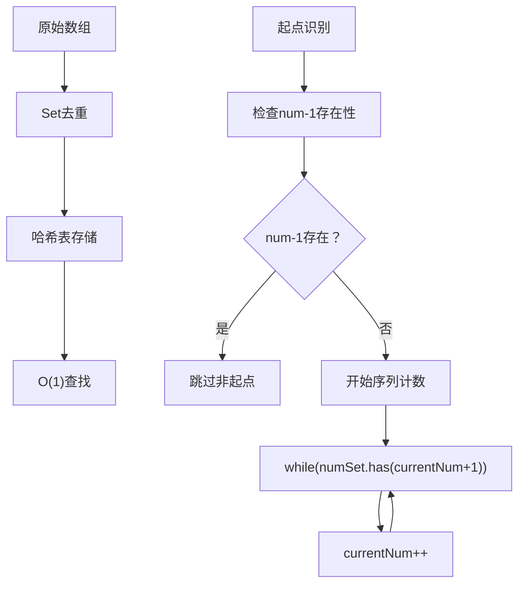
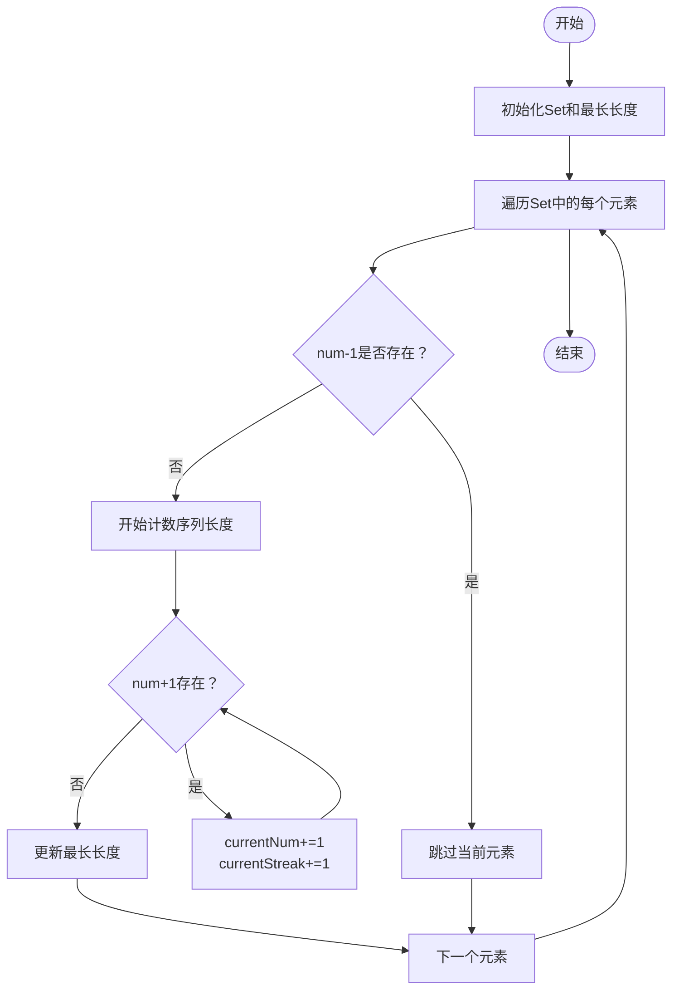
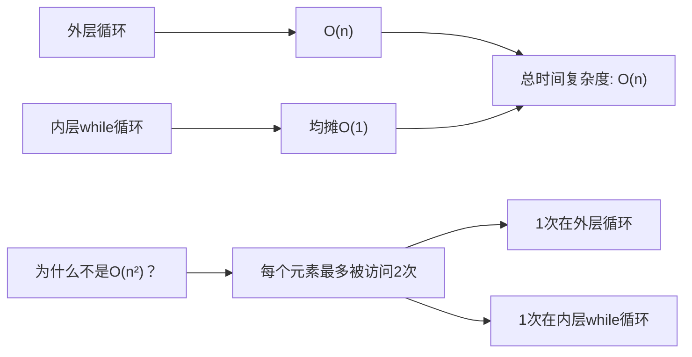
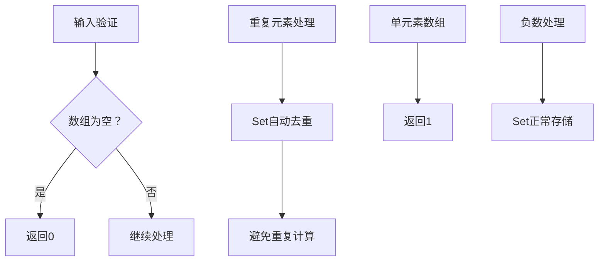
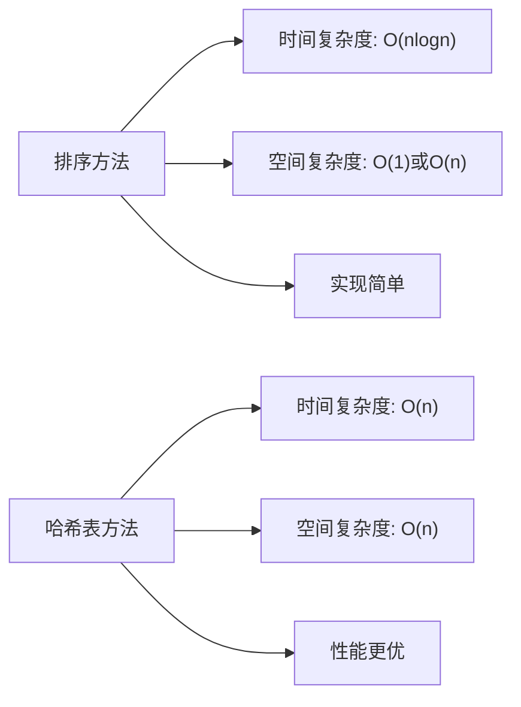

# 最长连续序列详解

<cite>
**本文档引用的文件**
- [128. 最长连续序列.md](file://128.%20最长连续序列.md)
</cite>

## 目录
1. [引言](#引言)
2. [问题概述](#问题概述)
3. [核心算法分析](#核心算法分析)
4. [数据结构设计](#数据结构设计)
5. [算法流程详解](#算法流程详解)
6. [复杂度分析](#复杂度分析)
7. [实现细节与优化](#实现细节与优化)
8. [边界情况处理](#边界情况处理)
9. [与其他算法的对比](#与其他算法的对比)
10. [实践应用与扩展](#实践应用与扩展)
11. [常见问题解答](#常见问题解答)
12. [总结](#总结)

## 引言

最长连续序列（Longest Consecutive Sequence）是LeetCode平台上的一道经典算法题，编号为128。该问题要求在未排序的整数数组中找到最长的连续数字序列长度。这道题不仅考察了对数据结构的理解，更重要的是体现了如何通过巧妙的数据组织来实现线性时间复杂度的算法设计思想。

本算法的核心在于理解"连续序列的起点"概念，通过哈希表实现O(1)的查找效率，从而达到整体O(n)的时间复杂度目标。

## 问题概述

### 问题定义
给定一个未排序的整数数组`nums`，需要找出数字连续的最长序列（不要求序列元素在原数组中连续）的长度。

### 输入输出规范
- **输入**：未排序的整数数组`nums`，其中`0 <= nums.length <= 10^5`且`-10^9 <= nums[i] <= 10^9`
- **输出**：最长连续序列的长度
- **时间复杂度要求**：O(n)
- **空间复杂度要求**：O(n)

### 示例分析
示例1：`nums = [100,4,200,1,3,2]` → 输出：4
- 最长连续序列是[1, 2, 3, 4]，长度为4

示例2：`nums = [0,3,7,2,5,8,4,6,0,1]` → 输出：9
- 最长连续序列是[0,1,2,3,4,5,6,7,8]，长度为9

## 核心算法分析

### 算法思想
该算法采用"哈希表+起点识别"的策略，关键洞察是：**只有连续序列的第一个数字才没有前驱数字（num-1）**。

### 核心策略
1. **去重优化**：使用Set自动去除重复元素
2. **起点识别**：通过检查`num-1`是否存在来确定是否为序列起点
3. **线性扫描**：避免重复计算，确保每个元素最多被访问常数次

### 算法优势
- 时间复杂度严格为O(n)，优于排序方法的O(nlogn)
- 空间复杂度O(n)，用于存储哈希表
- 逻辑简洁，易于理解和实现

## 数据结构设计

### 哈希表选择


**图表来源**
- [128. 最长连续序列.md](file://128.%20最长连续序列.md#L33-L78)

### 数据结构特性
- **Set结构**：提供O(1)的插入和查找操作
- **去重机制**：自动过滤重复元素，避免重复计算
- **无序存储**：不依赖元素的原始顺序

## 算法流程详解

### 主要流程图


**图表来源**
- [128. 最长连续序列.md](file://128.%20最长连续序列.md#L51-L78)

### 关键步骤解析

#### 步骤1：数据预处理
- 将数组转换为Set，实现去重和O(1)查找
- 初始化最长序列长度为0

#### 步骤2：起点识别机制
```javascript
// 关键判断逻辑
if (!numSet.has(num - 1)) {
    // num是序列起点
}
```
- 这个条件确保只从序列的第一个数字开始计数
- 避免重复计算同一序列的不同部分

#### 步骤3：序列计数过程
```javascript
let currentNum = num;
let currentStreak = 1;
while (numSet.has(currentNum + 1)) {
    currentNum += 1;
    currentStreak += 1;
}
```
- 从起点开始，连续查找下一个数字
- 直到找不到下一个连续数字为止

#### 步骤4：结果更新
```javascript
longestStreak = Math.max(longestStreak, currentStreak);
```
- 维护全局最大值
- 确保最终返回最长序列长度

## 复杂度分析

### 时间复杂度分析


**图表来源**
- [128. 最长连续序列.md](file://128.%20最长连续序列.md#L80-L87)

### 空间复杂度分析
- **Set存储**：O(n)空间用于存储所有唯一元素
- **辅助变量**：O(1)额外空间
- **总体空间复杂度**：O(n)

### 复杂度证明
关键在于理解"每个元素最多被访问两次"这一重要性质：
1. 第一次访问：在外层循环中作为候选起点
2. 第二次访问：在内层while循环中作为序列的一部分

由于不会出现重复计算同一个序列的情况，总访问次数不超过3n，因此时间复杂度为O(n)。

## 实现细节与优化

### 边界情况处理


**图表来源**
- [128. 最长连续序列.md](file://128.%20最长连续序列.md#L26-L30)

### 代码实现要点
1. **去重策略**：使用Set自动处理重复元素
2. **起点判断**：通过`!numSet.has(num-1)`精确识别起点
3. **循环终止**：使用while循环直到找不到下一个连续数字
4. **结果维护**：实时更新全局最大值

### 性能优化技巧
- **避免重复计算**：通过起点识别机制确保每个序列只计算一次
- **内存优化**：只存储必要的Set结构，不创建额外的中间数组
- **早期退出**：在找到更长序列时及时更新结果

## 边界情况处理

### 特殊输入场景
1. **空数组**：直接返回0
2. **单元素数组**：返回1
3. **全重复数组**：如[1,1,1,1] → 返回1
4. **负数数组**：如[-1,-3,-2] → 返回2（序列[-3,-2]）
5. **极大范围数组**：支持-10^9到10^9的数值范围

### 错误处理策略
- 数组长度边界：0 ≤ length ≤ 10^5
- 数值范围边界：-10^9 ≤ nums[i] ≤ 10^9
- 内存限制考虑：O(n)空间复杂度

## 与其他算法的对比

### 传统排序方法


### 算法对比分析
| 方案 | 时间复杂度 | 空间复杂度 | 实现难度 | 适用场景 |
|------|------------|------------|----------|----------|
| 排序+线性扫描 | O(nlogn) | O(1) | 简单 | 一般场景 |
| 哈希表 | O(n) | O(n) | 中等 | 性能敏感场景 |
| 动态规划 | O(n) | O(n) | 困难 | 复杂变种 |

### 选择原则
- 当追求最优性能时选择哈希表方法
- 当内存受限且n较小时可考虑排序方法
- 对于算法面试，哈希表方法更受青睐

## 实践应用与扩展

### 应用场景
1. **数据分析**：识别数据中的连续趋势
2. **库存管理**：优化连续商品的存储布局
3. **任务调度**：识别连续执行的任务序列
4. **网络监控**：检测连续的异常事件

### 算法变种
1. **最长递增子序列**：需要排序或动态规划
2. **最长连续递增序列**：简化版，只需一次遍历
3. **k差等差数列**：扩展到公差为k的等差序列
4. **多维连续序列**：扩展到二维或更高维度

### 扩展实现
```javascript
// 变种：最长连续递增序列
function longestConsecutiveIncreasing(nums) {
    const set = new Set(nums);
    let maxLength = 0;
    
    for (const num of set) {
        // 只有当num-1不存在时才开始计数
        if (!set.has(num - 1)) {
            let current = num;
            let currentLength = 1;
            
            while (set.has(current + 1)) {
                current++;
                currentLength++;
            }
            
            maxLength = Math.max(maxLength, currentLength);
        }
    }
    
    return maxLength;
}
```

## 常见问题解答

### Q1：为什么使用Set而不是Array？
**A1**：Set提供O(1)的查找时间，而Array需要O(n)查找。对于大规模数据，这种差异至关重要。

### Q2：起点识别的原理是什么？
**A2**：只有连续序列的第一个数字才没有前驱数字。通过检查`num-1`的存在性，我们可以准确识别序列起点。

### Q3：如何证明时间复杂度是O(n)？
**A3**：虽然有嵌套循环，但每个元素最多被访问两次（一次在外层循环，一次在内层while循环），所以总复杂度为O(n)。

### Q4：如何处理重复元素？
**A4**：使用Set自动去重，重复元素会被忽略，避免重复计算。

### Q5：内存使用量如何控制？
**A5**：Set的空间复杂度为O(n)，其中n是数组中唯一元素的数量。在最坏情况下等于原数组长度。

## 总结

最长连续序列算法是一个经典的"巧妙数据结构+优化策略"的典型例子。其核心价值在于：

### 技术价值
1. **算法思维**：展示了如何通过数据结构设计来优化算法性能
2. **时间复杂度优化**：从O(nlogn)优化到O(n)，体现了算法设计的艺术
3. **空间换时间**：通过增加O(n)空间来换取O(1)的查找效率

### 学习要点
1. **起点识别**：这是整个算法的关键洞察
2. **去重处理**：Set的使用体现了数据预处理的重要性
3. **复杂度分析**：理解"均摊分析"在嵌套循环中的应用
4. **边界处理**：正确处理各种特殊情况

### 实践意义
该算法不仅在面试中经常出现，在实际工程中也有广泛应用价值，特别是在需要快速识别连续数据模式的场景中。掌握这个算法有助于培养算法设计的系统性思维和优化意识。

通过深入理解这个算法，读者可以更好地掌握算法设计的基本原则：选择合适的数据结构、识别关键的优化点、进行严格的复杂度分析，以及处理各种边界情况。