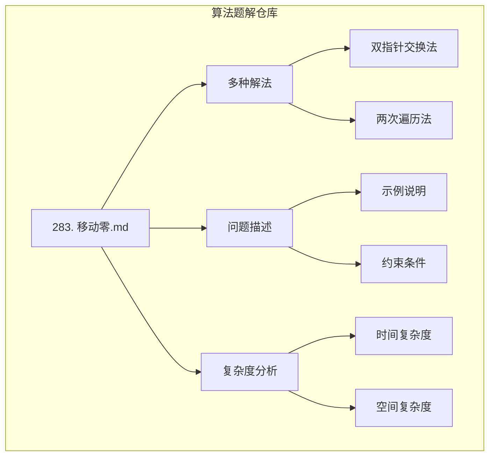
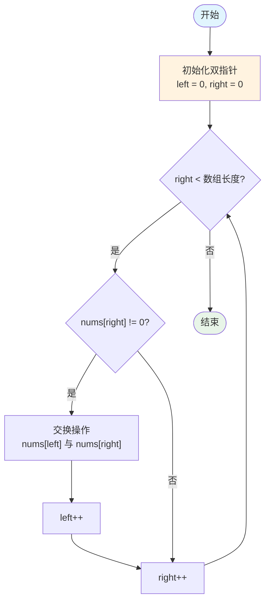
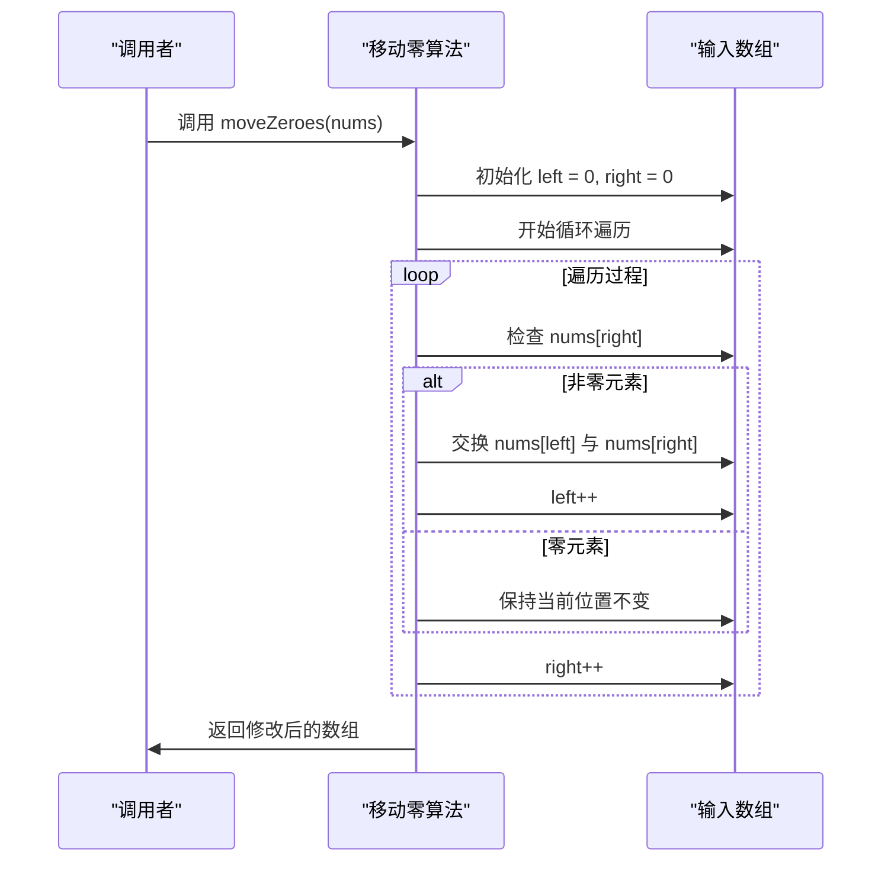
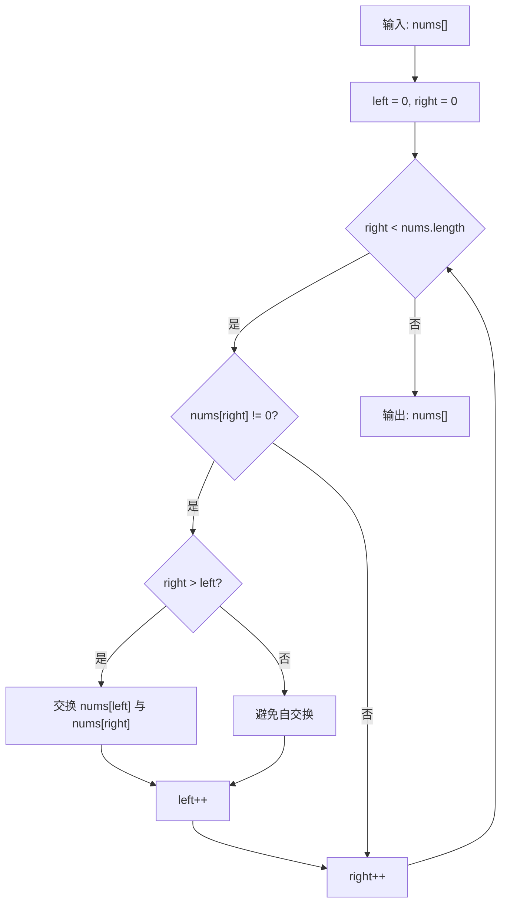
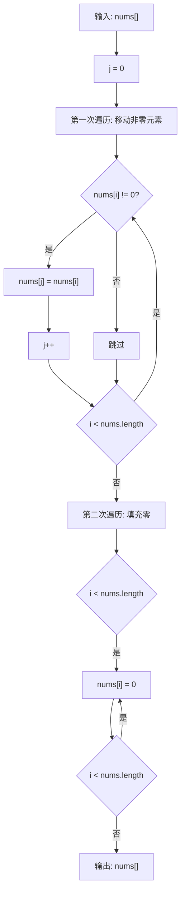
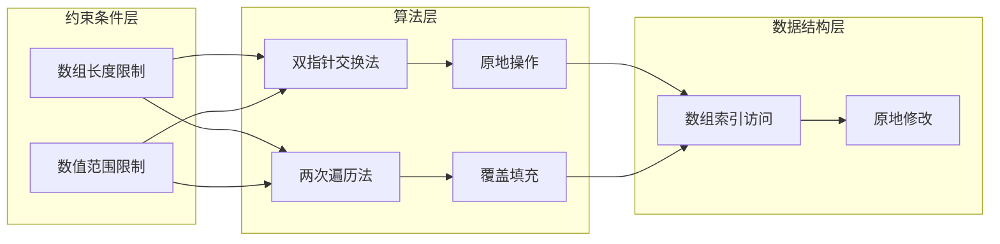

# 移动零详解

<cite>
**本文档引用的文件**
- [283. 移动零.md](file://283.%20移动零.md)
</cite>

## 目录
1. [引言](#引言)
2. [项目结构](#项目结构)
3. [核心组件](#核心组件)
4. [架构概览](#架构概览)
5. [详细组件分析](#详细组件分析)
6. [依赖关系分析](#依赖关系分析)
7. [性能考虑](#性能考虑)
8. [故障排除指南](#故障排除指南)
9. [结论](#结论)
10. [附录](#附录)

## 引言

移动零算法是力扣平台上的经典数组操作问题，要求将数组中的所有零元素移动到数组末尾，同时保持非零元素的相对顺序不变。该问题展示了双指针技术在数组操作中的强大应用，是算法学习中的重要案例。

本算法的核心挑战在于：
- 原地操作，不使用额外数组空间
- 保持非零元素的相对顺序
- 最小化数组元素的移动次数
- 处理各种边界情况

## 项目结构

本仓库专注于算法题解的整理和分享，采用Markdown格式记录各类算法问题的详细解析。

**图表来源**
- [283. 移动零.md](file://283.%20移动零.md#L1-L112)

**章节来源**
- [283. 移动零.md](file://283.%20移动零.md#L1-L112)

## 核心组件

### 主要算法实现

该问题提供了两种主要的解决方案，都采用了双指针技术：

#### 方法一：双指针交换法
- **核心思想**：使用左右两个指针维护数组状态
- **left指针**：指向已处理序列的尾部（非零元素的下一个位置）
- **right指针**：遍历数组寻找非零元素
- **时间复杂度**：O(n)
- **空间复杂度**：O(1)

#### 方法二：两次遍历覆盖法
- **核心思想**：分阶段处理非零元素和零元素
- **第一次遍历**：将非零元素移动到数组前部
- **第二次遍历**：将剩余位置填充为零
- **时间复杂度**：O(n)
- **空间复杂度**：O(1)

**章节来源**
- [283. 移动零.md](file://283.%20移动零.md#L30-L112)

## 架构概览

### 算法架构设计

**图表来源**
- [283. 移动零.md](file://283.%20移动零.md#L55-L69)

### 数据流架构

**图表来源**
- [283. 移动零.md](file://283.%20移动零.md#L55-L69)

## 详细组件分析

### 双指针交换法实现

#### 核心算法逻辑

**图表来源**
- [283. 移动零.md](file://283.%20移动零.md#L55-L69)

#### 关键实现要点

1. **优化的交换条件**：仅当 `right > left` 时才执行交换，避免不必要的自交换操作
2. **原地操作**：直接修改原数组，不使用额外空间
3. **相对顺序保持**：通过交换确保非零元素的相对位置不变
4. **边界情况处理**：正确处理单元素数组和全零数组

#### 算法复杂度分析

- **时间复杂度**：O(n) - 每个元素最多被访问两次
- **空间复杂度**：O(1) - 只使用常数级别的额外变量
- **操作次数**：最优情况下只需交换必要的零元素

**章节来源**
- [283. 移动零.md](file://283.%20移动零.md#L32-L73)

### 两次遍历覆盖法实现

#### 算法流程设计

**图表来源**
- [283. 移动零.md](file://283.%20移动零.md#L87-L102)

#### 实现特点

1. **直观性**：逻辑清晰，易于理解和实现
2. **稳定性**：两次遍历确保所有非零元素都被正确处理
3. **通用性**：适用于各种数组类型和大小
4. **可扩展性**：可以轻松修改为处理其他类型的"移除"操作

**章节来源**
- [283. 移动零.md](file://283.%20移动零.md#L75-L105)

### 边界情况处理

#### 特殊输入场景

| 场景 | 输入示例 | 预期输出 | 处理策略 |
|------|----------|----------|----------|
| 单元素数组 | [0] | [0] | 直接返回 |
| 单元素非零 | [5] | [5] | 直接返回 |
| 全零数组 | [0,0,0] | [0,0,0] | 无需交换 |
| 全非零数组 | [1,2,3] | [1,2,3] | 无需交换 |
| 零在中间 | [1,0,3,0,5] | [1,3,5,0,0] | 正常交换处理 |
| 零在末尾 | [1,2,0] | [1,2,0] | 只需移动left指针 |

#### 错误处理机制

1. **空数组检查**：虽然题目保证数组长度至少为1，但仍需考虑边界情况
2. **数值范围验证**：处理32位整数范围内的数值
3. **内存安全**：确保数组索引不会越界

**章节来源**
- [283. 移动零.md](file://283.%20移动零.md#L25-L28)

## 依赖关系分析

### 算法依赖关系

**图表来源**
- [283. 移动零.md](file://283.%20移动零.md#L25-L28)

### 外部依赖

该算法实现具有以下依赖特征：

1. **语言依赖**：JavaScript实现
2. **标准库依赖**：数组操作方法
3. **数学运算依赖**：比较运算符和算术运算
4. **内存管理**：JavaScript引擎自动管理

**章节来源**
- [283. 移动零.md](file://283.%20移动零.md#L25-L28)

## 性能考虑

### 时间复杂度分析

| 算法 | 最佳情况 | 平均情况 | 最坏情况 | 说明 |
|------|----------|----------|----------|------|
| 双指针交换法 | O(n) | O(n) | O(n) | 所有元素只访问常数次 |
| 两次遍历法 | O(n) | O(n) | O(n) | 两次完整遍历 |

### 空间复杂度分析

| 算法 | 空间复杂度 | 说明 |
|------|------------|------|
| 双指针交换法 | O(1) | 仅使用常数级额外变量 |
| 两次遍历法 | O(1) | 原地操作，无额外空间 |

### 性能优化策略

1. **避免不必要的交换**：双指针法通过条件判断避免自交换
2. **减少内存访问**：尽量减少数组元素的读写操作
3. **缓存友好性**：顺序访问数组元素，提高缓存命中率

## 故障排除指南

### 常见问题及解决方案

#### 问题1：交换操作导致错误
**症状**：数组元素顺序错误或出现重复元素
**原因**：忘记检查 `right > left` 条件
**解决方案**：添加条件判断避免自交换

#### 问题2：索引越界错误
**症状**：运行时抛出数组越界异常
**原因**：循环条件或数组访问越界
**解决方案**：严格检查 `right < nums.length` 条件

#### 问题3：相对顺序改变
**症状**：非零元素的相对位置发生变化
**原因**：交换操作破坏了原有顺序
**解决方案**：确保只在必要时进行交换

#### 问题4：性能不佳
**症状**：算法执行时间过长
**原因**：使用了低效的实现方式
**解决方案**：采用双指针交换法优化

### 调试技巧

1. **可视化跟踪**：打印每次交换后的数组状态
2. **边界测试**：测试极端情况如空数组、单元素数组
3. **性能监控**：测量不同输入规模下的执行时间
4. **单元测试**：编写全面的测试用例覆盖各种场景

**章节来源**
- [283. 移动零.md](file://283.%20移动零.md#L47-L48)

## 结论

移动零算法作为数组操作的经典问题，展示了双指针技术的强大应用。通过对比分析双指针交换法和两次遍历法，我们可以看到：

1. **双指针交换法**在时间效率上具有优势，特别适合处理大量非零元素的场景
2. **两次遍历法**在逻辑清晰度上有明显优势，更适合初学者理解和实现
3. 两种方法都满足原地操作的要求，空间复杂度均为O(1)
4. 算法的核心在于正确维护"有效数据"的边界，这是解决类似数组问题的关键思路

该算法不仅是一个编程练习，更是理解双指针技术和数组操作的重要里程碑。掌握这些概念将有助于解决更多复杂的数组和字符串问题。

## 附录

### 相关算法问题

移动零算法与以下问题有相似的解决思路：

1. **移除元素**：删除数组中指定值的元素
2. **数组去重**：移除排序数组中的重复元素
3. **颜色分类**：荷兰国旗问题的变种
4. **快乐数**：数字处理和循环检测

### 学习建议

1. **从简单开始**：先理解两次遍历法，再学习双指针交换法
2. **多做练习**：通过解决类似问题巩固理解
3. **分析复杂度**：学会评估不同算法的时间和空间复杂度
4. **关注边界**：始终考虑各种边界情况和异常输入