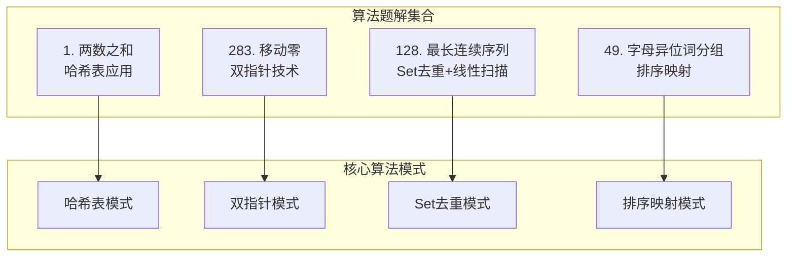
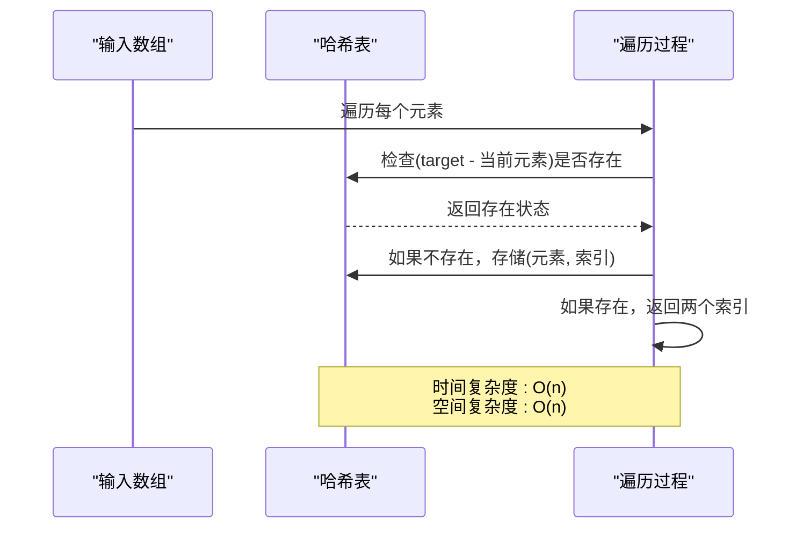
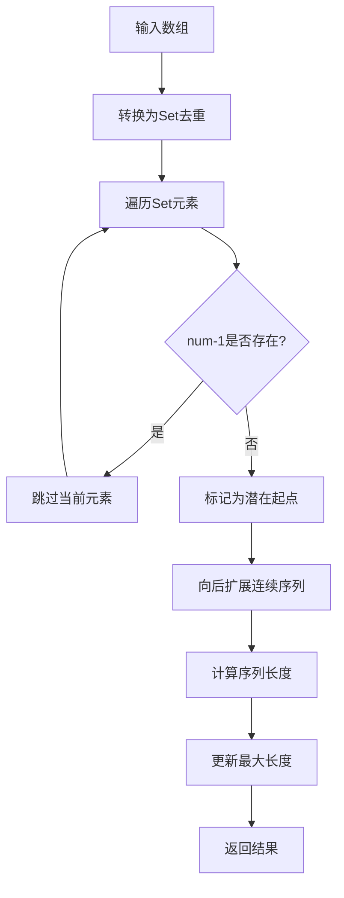
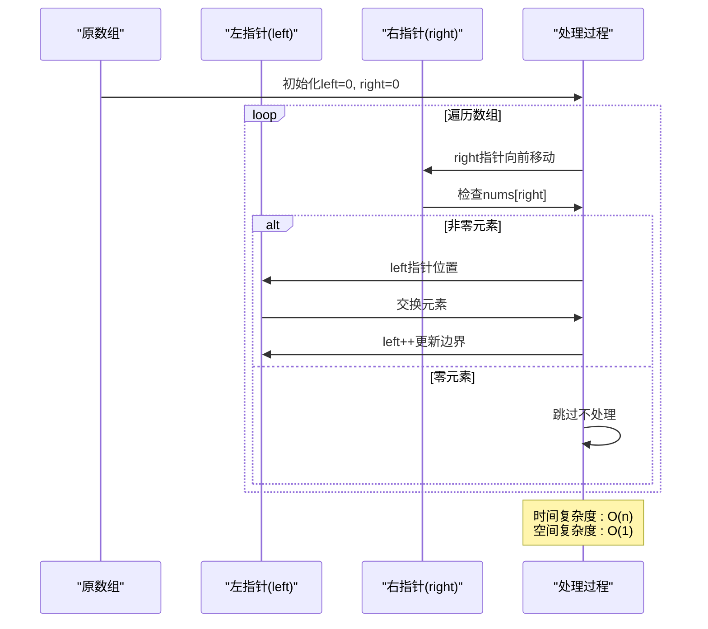
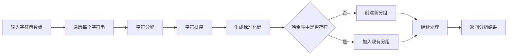
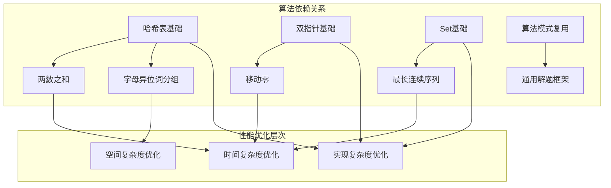
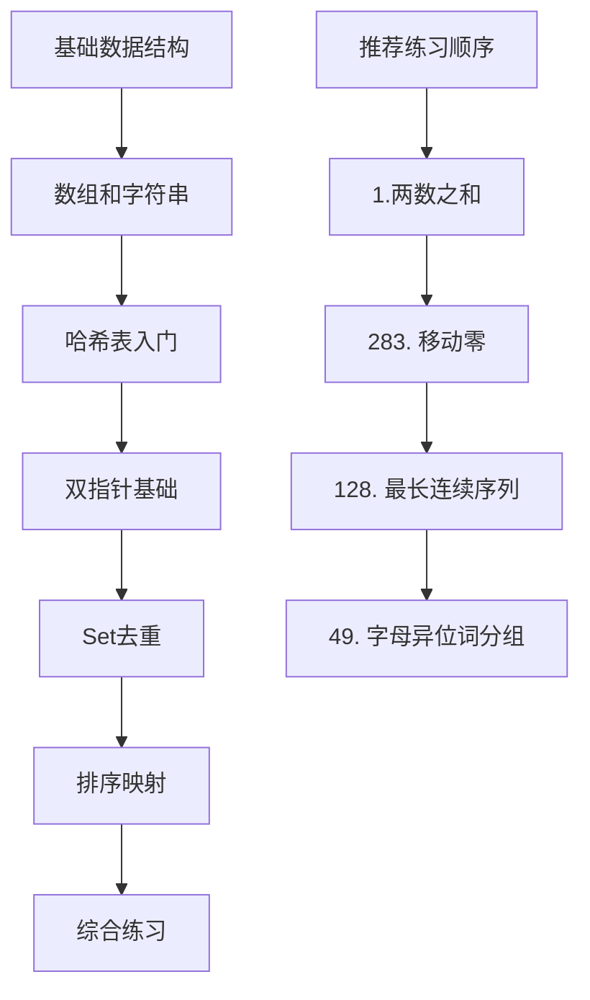

# 算法思想总结

<cite>
**本文档引用的文件**
- [1.两数之和.md](file://1.两数之和.md)
- [128. 最长连续序列.md](file://128. 最长连续序列.md)
- [283. 移动零.md](file://283. 移动零.md)
- [49.字母异位词分组.md](file://49.字母异位词分组.md)
</cite>

## 目录
1. [引言](#引言)
2. [项目结构](#项目结构)
3. [核心算法模式](#核心算法模式)
4. [架构概览](#架构概览)
5. [详细算法分析](#详细算法分析)
6. [依赖关系分析](#依赖关系分析)
7. [性能考虑](#性能考虑)
8. [学习路径建议](#学习路径建议)
9. [资源推荐](#资源推荐)
10. [故障排除指南](#故障排除指南)
11. [结论](#结论)

## 引言

本文件系统性地总结了四个经典算法题解中的核心思想和解题技巧，涵盖哈希表应用、双指针技术、Set去重、排序映射等关键算法模式。通过对这些题目的深入分析，旨在为不同水平的开发者提供可操作的学习指导和实践建议。

## 项目结构

本仓库包含四个精选的算法题解，每个都代表了一种重要的算法设计思想：



**图表来源**
- [1.两数之和.md](file://1.两数之和.md#L1-L100)
- [128. 最长连续序列.md](file://128. 最长连续序列.md#L1-L96)
- [283. 移动零.md](file://283. 移动零.md#L1-L112)
- [49.字母异位词分组.md](file://49.字母异位词分组.md#L1-L81)

## 核心算法模式

### 哈希表应用模式

哈希表是算法设计中最常用的工具之一，具有O(1)的平均查找、插入和删除复杂度。

**关键特性：**
- 快速查找和去重
- 键值对存储结构
- 动态大小调整
- 内存空间换时间

**应用场景：**
- 两数之和的互补数查找
- 字母异位词的分类存储
- 数组元素的频次统计

### 双指针技术模式

双指针是一种高效的数组和链表处理技术，通过维护两个动态指针来解决问题。

**核心思想：**
- 快慢指针维护有效数据边界
- 左右指针处理区间问题
- 交换操作减少不必要的写入

**优势：**
- 单次遍历完成
- 原地修改节省空间
- 减少操作次数

### Set去重模式

Set数据结构提供了唯一性保证和高效的查找能力。

**关键属性：**
- 自动去重机制
- O(1)查找复杂度
- 线性时间构建
- 空间换时间策略

**应用价值：**
- 处理重复元素问题
- 快速存在性检查
- 优化算法性能

### 排序映射模式

通过标准化数据结构来实现分组和分类。

**实现策略：**
- 数据标准化（排序）
- 唯一键生成
- 分组存储
- 结果聚合

**效率考量：**
- 排序成本O(k log k)
- 哈希表查找O(1)
- 整体复杂度O(nk log k)

## 架构概览

四个算法题解体现了不同的算法设计哲学和实现策略：

```mermaid
graph LR
subgraph "算法设计架构"
A[数据预处理层<br/>去重/排序/初始化]
B[核心算法层<br/>哈希表/双指针/Set/排序]
C[结果生成层<br/>输出格式化/数据聚合]
end
subgraph "性能优化策略"
D[时间复杂度优化<br/>O(n)线性算法]
E[空间复杂度优化<br/>原地操作/O(n)额外空间]
F[算法模式复用<br/>通用解题框架]
end
A --> B
B --> C
D --> B
E --> B
F --> B
```

**图表来源**
- [1.两数之和.md](file://1.两数之和.md#L36-L100)
- [128. 最长连续序列.md](file://128. 最长连续序列.md#L33-L96)
- [283. 移动零.md](file://283. 移动零.md#L32-L112)
- [49.字母异位词分组.md](file://49.字母异位词分组.md#L38-L81)

## 详细算法分析

### 1. 两数之和算法

#### 核心思想

两数之和问题展示了哈希表在互补数查找中的强大能力。通过一次遍历和哈希表存储，实现了O(n)时间复杂度的高效解决方案。



**图表来源**
- [1.两数之和.md](file://1.两数之和.md#L68-L90)

#### 关键实现技巧

1. **互补数查找**：利用target - nums[i]的概念，在哈希表中查找互补数
2. **遍历顺序优化**：先检查再存储，避免同一元素重复使用
3. **索引映射**：将元素值映射到其原始索引位置

**复杂度分析**
- 时间复杂度：O(n) - 单次线性遍历
- 空间复杂度：O(n) - 哈希表存储

**Section sources**
- [1.两数之和.md](file://1.两数之和.md#L36-L100)

### 2. 最长连续序列算法

#### 核心思想

最长连续序列问题巧妙地结合了Set去重和起点识别策略，实现了O(n)时间复杂度的线性算法。



**图表来源**
- [128. 最长连续序列.md](file://128. 最长连续序列.md#L33-L87)

#### 关键实现技巧

1. **起点识别**：通过检查num-1的存在性来确定序列起点
2. **避免重复计算**：只有起点才进行完整序列扩展
3. **线性摊销分析**：每个元素最多被访问两次

**复杂度分析**
- 时间复杂度：O(n) - 每个元素最多访问两次
- 空间复杂度：O(n) - Set存储

**Section sources**
- [128. 最长连续序列.md](file://128. 最长连续序列.md#L33-L96)

### 3. 移动零算法

#### 核心思想

移动零问题展示了双指针技术在原地数组操作中的优雅应用，通过快慢指针维护有效数据边界。



**图表来源**
- [283. 移动零.md](file://283. 移动零.md#L32-L73)

#### 双指针策略对比

| 方法 | 核心思想 | 时间复杂度 | 空间复杂度 | 适用场景 |
|------|----------|------------|------------|----------|
| 交换法 | 快慢指针原地交换 | O(n) | O(1) | 非零元素较多 |
| 两次遍历 | 覆盖+补零 | O(n) | O(1) | 代码简洁需求 |

**复杂度分析**
- 时间复杂度：O(n) - 单次线性遍历
- 空间复杂度：O(1) - 原地操作

**Section sources**
- [283. 移动零.md](file://283. 移动零.md#L32-L112)

### 4. 字母异位词分组算法

#### 核心思想

字母异位词分组问题展示了排序映射模式的强大功能，通过标准化键值实现智能分组。



**图表来源**
- [49.字母异位词分组.md](file://49.字母异位词分组.md#L38-L69)

#### 关键实现技巧

1. **标准化键生成**：通过字符排序创建唯一标识符
2. **动态分组管理**：哈希表自动管理分组结构
3. **结果聚合**：统一提取所有分组结果

**复杂度分析**
- 时间复杂度：O(nk log k) - n个字符串，每个长度k
- 空间复杂度：O(nk) - 存储所有字符串

**Section sources**
- [49.字母异位词分组.md](file://49.字母异位词分组.md#L38-L81)

## 依赖关系分析

四个算法题解之间存在微妙的依赖关系和相互借鉴：



**图表来源**
- [1.两数之和.md](file://1.两数之和.md#L36-L100)
- [128. 最长连续序列.md](file://128. 最长连续序列.md#L33-L96)
- [283. 移动零.md](file://283. 移动零.md#L32-L112)
- [49.字母异位词分组.md](file://49.字母异位词分组.md#L38-L81)

## 性能考虑

### 时间复杂度优化策略

1. **哈希表优化**
   - 避免重复存储和查找
   - 合理的哈希函数选择
   - 动态扩容策略

2. **双指针优化**
   - 减少不必要的交换操作
   - 智能指针移动策略
   - 边界条件优化

3. **Set操作优化**
   - 批量操作减少开销
   - 预分配容量
   - 避免重复查找

### 空间复杂度权衡

1. **原地操作优先**：尽可能使用O(1)额外空间
2. **缓存策略**：合理使用临时存储减少重复计算
3. **数据结构选择**：根据具体场景选择最优数据结构

## 学习路径建议

### 初学者路径



### 进阶提升路径

1. **算法模式深度理解**
   - 掌握每种模式的核心思想
   - 理解适用场景和限制条件
   - 学习模式间的组合应用

2. **复杂度分析能力**
   - 建立严格的数学分析习惯
   - 学会识别和避免低效操作
   - 掌握优化技巧和边界条件

3. **代码质量提升**
   - 注重可读性和可维护性
   - 建立测试驱动开发习惯
   - 学习调试和性能分析技巧

## 资源推荐

### 在线学习资源

1. **算法平台**
   - LeetCode官方题库
   - 牛客网算法练习
   - Codeforces竞赛平台

2. **学习资料**
   - 《算法导论》- Thomas H. Cormen
   - 《编程珠玑》- Jon Bentley
   - 《算法图解》- Aditya Bhargava

3. **在线课程**
   - MIT算法课程视频
   - Coursera算法专项课程
   - 中国大学MOOC算法课程

### 实践建议

1. **每日练习**
   - 设定每日至少一道算法题
   - 记录解题思路和复杂度分析
   - 定期回顾和总结

2. **代码规范**
   - 编写清晰的注释和文档
   - 建立个人算法库
   - 参与开源项目贡献

3. **面试准备**
   - 系统性复习常见算法模式
   - 练习多种解法的比较
   - 提升口头表达和演示能力

## 故障排除指南

### 常见问题诊断

1. **性能问题**
   - 检查时间复杂度是否符合预期
   - 分析是否存在重复计算
   - 验证数据结构选择是否合适

2. **边界条件错误**
   - 测试空数组和单元素数组
   - 验证负数和零的处理
   - 检查索引越界问题

3. **内存泄漏**
   - 确认及时释放临时对象
   - 检查循环中的对象创建
   - 验证垃圾回收机制

### 调试技巧

1. **单元测试**
   - 编写覆盖所有边界条件的测试
   - 使用随机数据验证正确性
   - 性能基准测试对比

2. **可视化分析**
   - 绘制算法执行流程图
   - 记录关键变量变化
   - 分析复杂度趋势

3. **代码审查**
   - 定期回顾自己的代码
   - 寻求他人反馈和建议
   - 学习他人的优秀实现

## 结论

这四个算法题解展现了计算机科学中最重要的四种算法模式：哈希表应用、双指针技术、Set去重和排序映射。通过深入理解和掌握这些模式，开发者可以：

1. **建立算法思维框架**：理解不同问题类型的最优解法
2. **提升编程能力**：掌握高效的数据结构和算法实现
3. **增强问题解决能力**：培养系统性分析和解决复杂问题的能力
4. **为职业发展奠定基础**：为技术面试和实际工作中的算法问题提供坚实支撑

建议读者按照本文的学习路径，循序渐进地掌握这些核心算法模式，并通过大量的实践练习来巩固和深化理解。记住，算法学习是一个持续的过程，需要不断地练习、反思和改进。