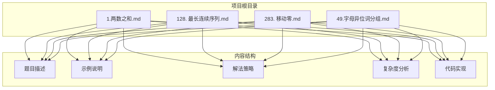
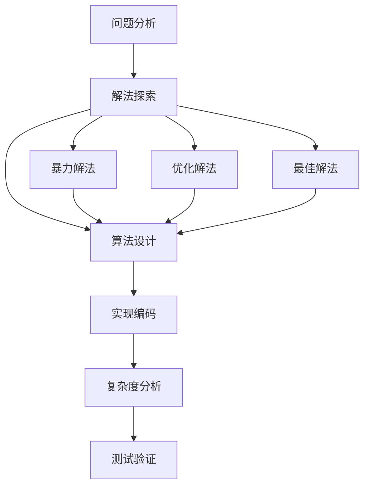
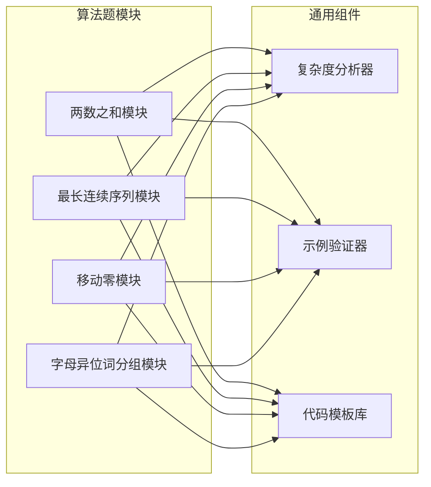
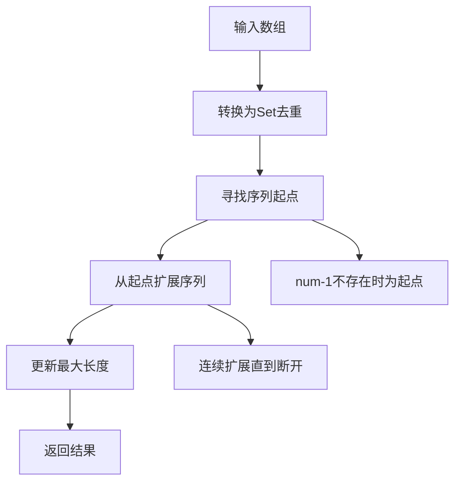
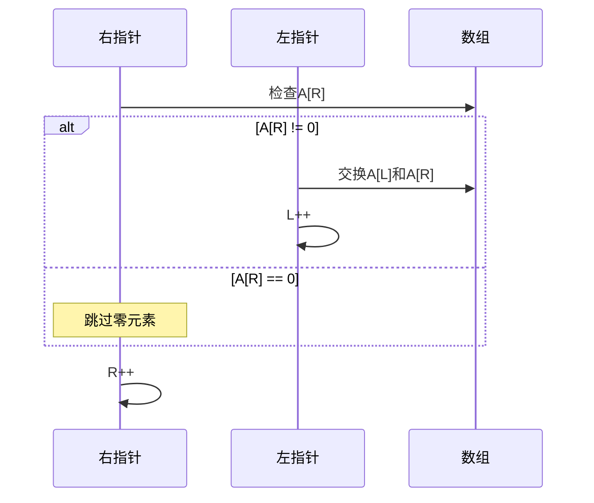
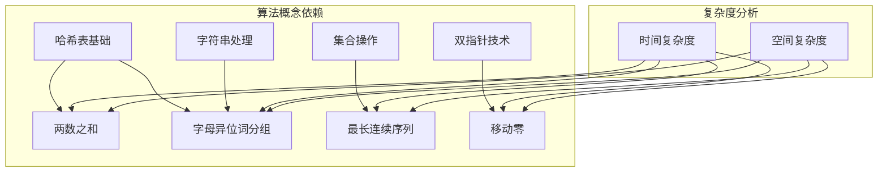

# 项目概述

<cite>
**本文档引用的文件**
- [1.两数之和.md](file://1.两数之和.md)
- [128. 最长连续序列.md](file://128. 最长连续序列.md)
- [283. 移动零.md](file://283. 移动零.md)
- [49.字母异位词分组.md](file://49.字母异位词分组.md)
</cite>

## 目录
1. [简介](#简介)
2. [项目结构](#项目结构)
3. [核心组件](#核心组件)
4. [架构概览](#架构概览)
5. [详细组件分析](#详细组件分析)
6. [依赖关系分析](#依赖关系分析)
7. [性能考虑](#性能考虑)
8. [故障排除指南](#故障排除指南)
9. [结论](#结论)

## 简介

这是一个专注于力扣算法题解的项目集合，包含了四个经典的算法问题及其解决方案。该项目旨在为算法学习者提供清晰、易懂的题解文档，涵盖从基础到进阶的多种解法策略。每个问题都提供了详细的题目描述、示例、解决方案分析以及复杂度评估。

该项目采用Markdown格式组织，便于版本控制和在线阅读。每个算法题都包含：
- 问题描述和约束条件
- 多种解法策略对比
- 详细的算法流程说明
- 时间和空间复杂度分析
- 实际的代码实现示例

## 项目结构

项目采用按问题分类的简单文件组织结构，每个算法题独立成文：



**图表来源**
- [1.两数之和.md](file://1.两数之和.md#L1-L100)
- [128. 最长连续序列.md](file://128. 最长连续序列.md#L1-L96)
- [283. 移动零.md](file://283. 移动零.md#L1-L112)
- [49.字母异位词分组.md](file://49.字母异位词分组.md#L1-L81)

**章节来源**
- [1.两数之和.md](file://1.两数之和.md#L1-L100)
- [128. 最长连续序列.md](file://128. 最长连续序列.md#L1-L96)
- [283. 移动零.md](file://283. 移动零.md#L1-L112)
- [49.字母异位词分组.md](file://49.字母异位词分组.md#L1-L81)

## 核心组件

### 算法题解组件

项目包含四个核心算法题解组件，每个都针对不同的算法概念：

1. **两数之和** - 哈希表查找算法
2. **最长连续序列** - 集合去重与线性扫描
3. **移动零** - 双指针原地操作
4. **字母异位词分组** - 字符串排序与分组

### 解决方案模式

每个组件都遵循统一的解决方案模式：



**章节来源**
- [1.两数之和.md](file://1.两数之和.md#L36-L100)
- [128. 最长连续序列.md](file://128. 最长连续序列.md#L31-L96)
- [283. 移动零.md](file://283. 移动零.md#L30-L112)
- [49.字母异位词分组.md](file://49.字母异位词分组.md#L38-L81)

## 架构概览

项目采用扁平化的文档架构，每个算法题都是独立的模块：



**图表来源**
- [1.两数之和.md](file://1.两数之和.md#L36-L100)
- [128. 最长连续序列.md](file://128. 最长连续序列.md#L31-L96)
- [283. 移动零.md](file://283. 移动零.md#L30-L112)
- [49.字母异位词分组.md](file://49.字母异位词分组.md#L38-L81)

## 详细组件分析

### 两数之和组件

#### 问题描述与约束
- 输入：整数数组 `nums` 和目标值 `target`
- 输出：两个数字的数组下标
- 约束：每个元素只能使用一次，保证存在唯一解

#### 解法策略对比

```mermaid
graph TB
subgraph "两数之和解法"
A[暴力枚举法<br/>时间复杂度: O(n²)<br/>空间复杂度: O(1)]
B[哈希表法<br/>时间复杂度: O(n)<br/>空间复杂度: O(n)]
end
A --> C[双重循环遍历]
B --> D[单次遍历+查找]
C --> E[适合小规模数据]
D --> F[推荐用于大规模数据]
```

**图表来源**
- [1.两数之和.md](file://1.两数之和.md#L38-L90)

#### 核心实现要点

哈希表方法的关键在于：
1. 使用 `Map.has()` 检查目标差值是否存在
2. 使用 `Map.set()` 存储已遍历元素
3. 通过 `Map.get()` 获取对应索引

**章节来源**
- [1.两数之和.md](file://1.两数之和.md#L36-L100)

### 最长连续序列组件

#### 算法设计理念



**图表来源**
- [128. 最长连续序列.md](file://128. 最长连续序列.md#L33-L87)

#### 复杂度优化技巧

该算法的核心优化在于"寻找起点"的策略：
- 时间复杂度：O(n) - 每个元素最多被访问两次
- 空间复杂度：O(n) - 使用Set存储所有元素

**章节来源**
- [128. 最长连续序列.md](file://128. 最长连续序列.md#L31-L96)

### 移动零组件

#### 双指针策略



**图表来源**
- [283. 移动零.md](file://283. 移动零.md#L32-L73)

#### 两种实现方法

1. **交换法**：一次遍历完成，减少写操作
2. **覆盖法**：两次遍历，逻辑更直观

**章节来源**
- [283. 移动零.md](file://283. 移动零.md#L30-L112)

### 字母异位词分组组件

#### 分组策略


**图表来源**
- [49.字母异位词分组.md](file://49.字母异位词分组.md#L38-L69)

#### 关键技术点

- 使用字符串排序作为分组键
- 利用Map的 `has()`, `set()`, `get()` 方法
- 时间复杂度：O(nk log k)，其中k为字符串长度

**章节来源**
- [49.字母异位词分组.md](file://49.字母异位词分组.md#L38-L81)

## 依赖关系分析

### 内部依赖关系



### 外部依赖情况

项目采用纯JavaScript实现，无外部依赖：
- 标准Map对象
- 标准Set对象  
- 原生数组操作

**章节来源**
- [1.两数之和.md](file://1.两数之和.md#L36-L100)
- [128. 最长连续序列.md](file://128. 最长连续序列.md#L31-L96)
- [283. 移动零.md](file://283. 移动零.md#L30-L112)
- [49.字母异位词分组.md](file://49.字母异位词分组.md#L38-L81)

## 性能考虑

### 时间复杂度优化

| 算法 | 暴力解法 | 优化解法 | 最优解法 |
|------|----------|----------|----------|
| 两数之和 | O(n²) | O(n²) | O(n) |
| 最长连续序列 | O(n log n) | O(n) | O(n) |
| 移动零 | O(n²) | O(n²) | O(n) |
| 字母异位词分组 | O(nk log k) | O(nk log k) | O(nk log k) |

### 空间复杂度权衡

- **哈希表方法**：空间换时间，适合大数据集
- **原地操作**：节省内存，但可能增加操作次数
- **排序方法**：需要额外空间存储排序结果

## 故障排除指南

### 常见问题诊断

1. **索引越界错误**
   - 检查数组边界条件
   - 确保循环条件正确设置

2. **重复计算问题**
   - 在最长连续序列中确认起点识别逻辑
   - 验证哈希表键值对的正确性

3. **内存泄漏风险**
   - 及时清理不需要的数据结构
   - 注意大数组的内存使用

4. **性能瓶颈识别**
   - 分析算法的时间复杂度
   - 识别潜在的优化机会

### 调试建议

- 使用单元测试验证边界条件
- 逐步跟踪算法执行流程
- 分析不同输入规模下的性能表现

**章节来源**
- [1.两数之和.md](file://1.两数之和.md#L29-L35)
- [128. 最长连续序列.md](file://128. 最长连续序列.md#L26-L30)
- [283. 移动零.md](file://283. 移动零.md#L25-L29)
- [49.字母异位词分组.md](file://49.字母异位词分组.md#L32-L37)

## 结论

这个力扣算法题解项目为算法学习者提供了系统性的学习资源。通过四个经典问题的深入分析，涵盖了：

- **基础算法概念**：哈希表、双指针、集合操作
- **复杂度分析**：时间与空间效率的权衡
- **实际应用技巧**：从简单到复杂的解法演进
- **最佳实践**：代码实现和性能优化指导

项目结构清晰，内容组织合理，既适合算法初学者理解基本概念，也为有经验的开发者提供了深入的技术细节。每个算法题都提供了多种解法策略，有助于培养算法思维和问题解决能力。